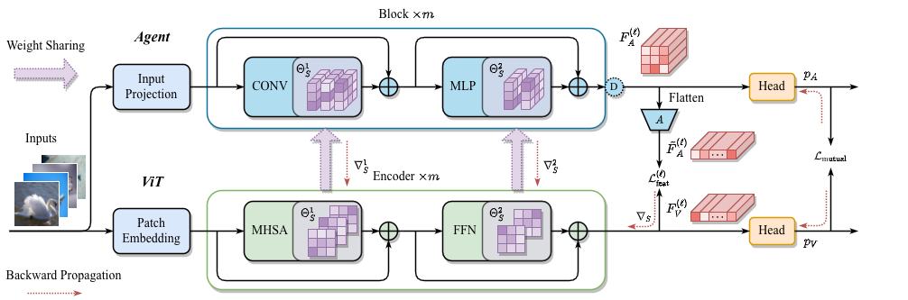

# Bootstrapping ViTs

**Towards liberating vision Transformers from pre-training.**

*Official code for paper [Bootstrapping ViTs: Towards Liberating Vision Transformers from Pre-training](https://arxiv.org/abs/2112.03552)*

Authors: Haofei Zhang, Jiarui Duan, Mengqi Xue, Jie Song, Li Sun, Mingli Song



## Results (Top-1 Accuracy)

### 1. CIFAR

| Model | Method | CIFAR-10 | CIFAR-100 |
| :---: | :----: | :------: | :-------: |
| CNNs | EfficientNet-B2 <br> ResNet50 <br> Agent-S <br> Agent-B | 94.14 <br> 94.92 <br> 94.18 <br> 94.83 | 75.55 <br> 77.57 <br> 74.62 <br> 74.78 |
| ViTs | ViT-S <br> ViT-S-SAM <br> ViT-S-Sparse <br> ViT-B <br> ViT-B-SAM <br> ViT-B-Sparse | 87.32 <br> 87.77 <br> 87.43 <br> 79.24 <br> 86.57 <br> 83.87 | 61.25 <br> 62.60 <br> 62.29 <br> 53.07 <br> 58.18 <br> 57.22|
| Pre-trained ViTs | ViT-S <br> ViT-B | 95.70 <br> 97.17 <br> | 80.91 <br> 84.95 |
| Ours Joint  | Agent-S <br> ViT-S <br> Agent-B <br> ViT-B | 94.90 <br> 95.14 <br> 95.06 <br> 95.00 | 74.06 <br> 76.19 <br> 76.57 <br> 77.83 |
| Ours Shared | Agent-S <br> ViT-S <br> Agent-B <br> ViT-B | 93.22 <br> 93.72 <br> 92.66 <br> 93.34 | 74.06 <br> 75.50 <br> 74.11 <br> 75.71 |

### 2. ImageNet

| Method | 5% images | 10% images | 50% images |
| :----: | :-------: | :--------: | :--------: |
| ResNet50 <br> Agent-B| 35.43 <br> 35.28 | 50.86 <br> 47.46 | 70.05 <br> 68.13 |
| ViT-B <br> ViT-B-SAM <br> ViT-B-Sparse | 16.60 <br> 16.67 <br> 10.39 | 28.11 <br> 28.66 <br> 28.92 | 63.40 <br> 64.37 <br> 66.01 |
| Ours-Joint <br> Ours-Shared | 36.01 <br> 33.06 | 49.73 <br> 45.75 | 71.36 <br> 66.48 |

## Quick Start

### 1. Prepare dataset

* CIFAR: download cifar dataset to folder `~/datasets/cifar` (you may specify this in configuration files).
* ImageNet: download ImageNet dataset to folder `~/datasets/ILSVRC2012` and pre-process with this [script](https://gist.githubusercontent.com/antoinebrl/7d00d5cb6c95ef194c737392ef7e476a/raw/dc53ad5fcb69dcde2b3e0b9d6f8f99d000ead696/prepare.sh).
* We also support other datasets such as CUB200, Sketches, Stanford Cars, TinyImageNet.

### 2. Prepare cv-lib-PyTorch

Our code requires [cv-lib-PyTorch](https://github.com/zhfeing/cv-lib-PyTorch/tree/bootstrapping_vits). You should download this repo and checkout to tag `bootstrapping_vits`.
> `cv-lib-PyTorch` is an open source repo currently maintained by me.

### 3. Requirements

* torch>=1.10.2
* torchvision>=0.11.3
* tqdm
* timm
* tensorboard
* scipy
* PyYAML
* pandas
* numpy

### 4. Train from scratch

In dir `config`, we provide some configurations for training, including CIFAR100 and ImageNet-10%.
The following script will start training `agent-small` from scratch on CIFAR100.
> For training with SAM optimizer, the option `--worker` should be set to `sam_train_worker`.

```bash
export PYTHONPATH=/path/to/cv-lib-PyTorch
export CUDA_VISIBLE_DEVICES=0,1

port=9872
python dist_engine.py \
    --num-nodes 1 \
    --rank 0 \
    --master-url tcp://localhost:${port} \
    --backend nccl \
    --multiprocessing \
    --file-name-cfg cls \
    --cfg-filepath config/cifar100/cnn/agent-small.yaml \
    --log-dir run/cifar100/cnn/agent-small \
    --worker worker
```

### 5. Ours Joint

```bash
export PYTHONPATH=/path/to/project/cv-lib-PyTorch
export CUDA_VISIBLE_DEVICES=0,1

port=9873
python dist_engine.py \
    --num-nodes 1 \
    --rank 0 \
    --master-url tcp://localhost:${port} \
    --backend nccl \
    --multiprocessing \
    --file-name-cfg joint \
    --cfg-filepath config/cifar100/joint/agent-small-vit-small.yaml \
    --log-dir run/cifar100/joint/agent-small-vit-small \
    --use-amp \
    --worker mutual_worker
```

### 6. Ours Shared

```bash
export PYTHONPATH=/path/to/project/cv-lib-PyTorch
export CUDA_VISIBLE_DEVICES=0,1

port=9873
python dist_engine.py \
    --num-nodes 1 \
    --rank 0 \
    --master-url tcp://localhost:${port} \
    --backend nccl \
    --multiprocessing \
    --file-name-cfg shared \
    --cfg-filepath config/cifar100/shared/agent-base-res_like-vit-base.yaml \
    --log-dir run/cifar100/shared/agent-base-res_like-vit-base \
    --use-amp \
    --worker mutual_worker
```

> After training, the accuracy of the final epoch is reported instead of the best one.

## Citation

If you found this work useful for your research, please cite our paper:

```
@article{zhang2021bootstrapping,
  title={Bootstrapping ViTs: Towards Liberating Vision Transformers from Pre-training},
  author={Zhang, Haofei and Duan, Jiarui and Xue, Mengqi and Song, Jie and Sun, Li and Song, Mingli},
  journal={arXiv preprint arXiv:2112.03552},
  year={2021}
}
```
